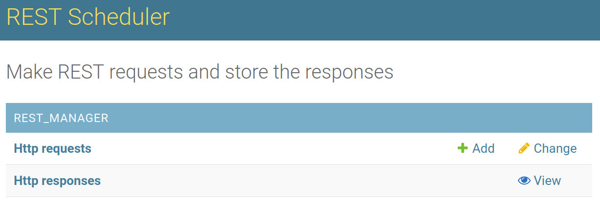

# REST request scheduler

This application allows to make REST requests, either immediately or schedule it
for later execution.

REST request scheduler supports:

* Making REST requests, sending and receiving JSON data.
* Schedule the request to be run at a later time (please be aware the times are in UTC).
* Only authenticated users can use the system.
* Check the status of the requests and view the responses
    * The user needs to refresh the page, because auto-refresh mechanism is not implemented yet.

The application can be tested here: https://afternoon-depths-71837.herokuapp.com/

NOTE: The application might take some time to load at the first time, because a free account is being used, and after 30 minutes of inactivity, the Heroku worker goes to sleep.

## How to use it

After logging in, the user is presented with the following interface:

Here a new request can be added. The responses can only be visualized and multiple responses can exist for the same request (for example, a request might be executed again in the future).
